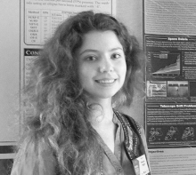

{:style="float: left;margin-right: 15px;margin-top: 0px;"}

My name is Oksana Hagen, and this is my professional website and blog, where I share my work and everyting robot and AI related. 

I am currently working as a researcher at [Softbank Robotics Europe](https://www.softbankrobotics.com/emea/en) AI lab and also completing my PhD at [Plymouth University](https://www.plymouth.ac.uk/research/robotics-neural-systems/people) under Marie Skłodowska-Curie European Industrial Doctorate program [APRIL](https://www.fose1.plymouth.ac.uk/socem/crns/april/#Home). 

I am working on a principled way to build prior knowledge for optimising reinforcement learning in robotic scenarios. I am interested in unsupervised learning, reinforcement learning, evolutionary strategies and neuroscience.

Previously I have received a joint Erasmus+ M.Sc. degree with distiction in Vision and Robotics ([ViBOT](https://www.vibot.org/)) from the Universities of Burgundy (France), Girona (Spain), and Heriot-Watt University (Edinburgh, UK) in 2015. My [thesis](https://ieeexplore.ieee.org/document/7500627) was focused on multi-object estimation in space-situational awareness context. During my masters I have been working at [ViCOROB lab](https://vicorob.udg.edu/) as an assistant for medical imaging project in partnership with Clinic Hospital of Barcelona. 

In 2013 I have completed my B.Sc. degree in Electrical and Computer Engineering from National Chiao Tung University (Taiwan). During my time in Taiwan I have completed two internships at [Industrial Technology Research Institute](https://www.itri.org.tw/eng/) mostly focused on applications of computer vision.

